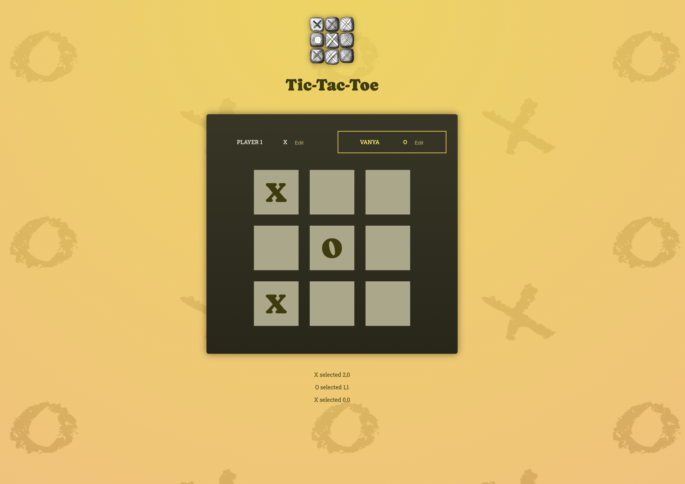

# Tic-Tac-Toe

## Getting started

To run the project locally, follow these steps:

- Clone the repository to your local machine.
- Navigate into the directory with name: tic-tac
- Install the required dependencies by running: npm install
- Start the application by running: npm run dev
- Open your browser and visit

## Description

Tic-Tac-Toe is a simple game board with 'X' and 'O', which you can play with a buddy. You can add your name and the name of your buddy and start play. The name of the winner will be displayed at the end.

## Creator 

- [Ivanka Zlateva](https://gitlab.com/ipz06)
